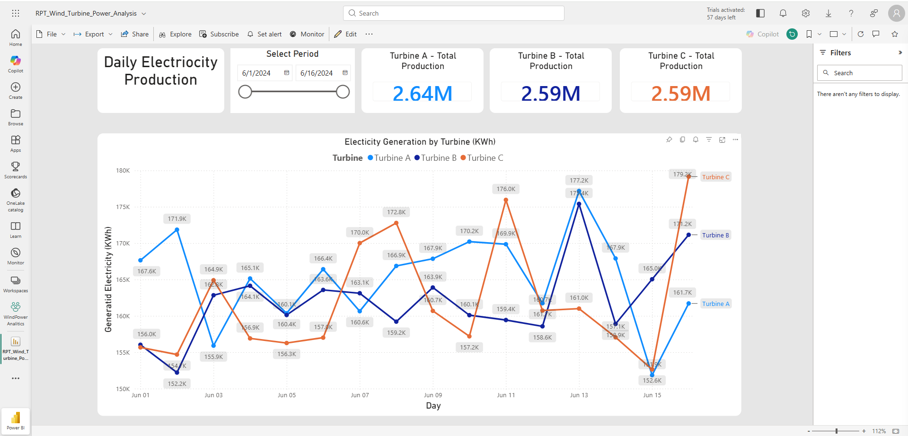
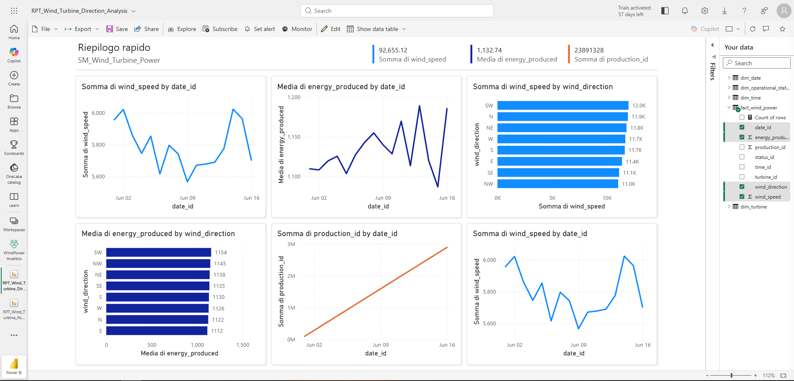
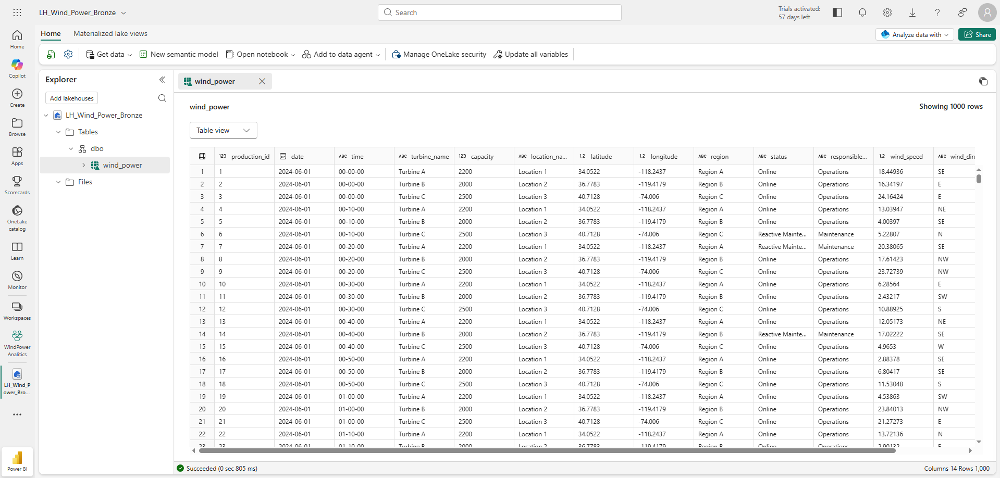
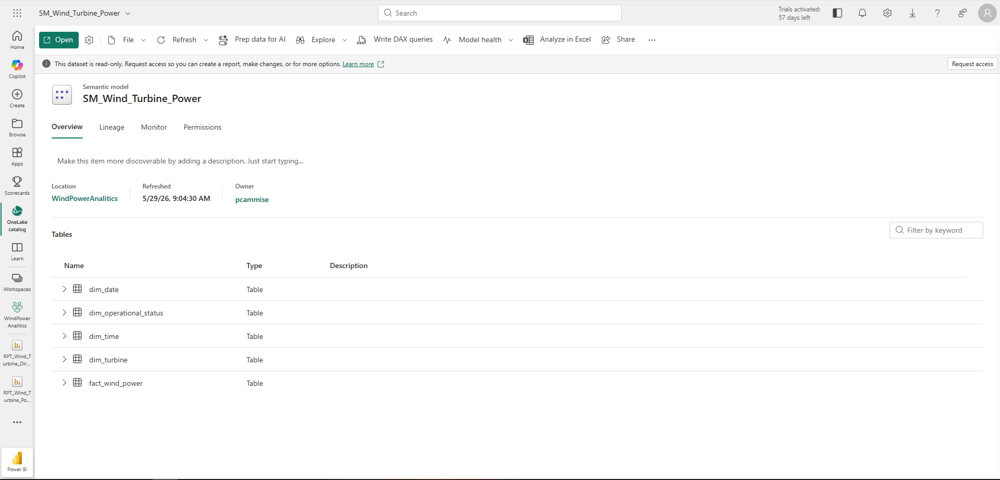
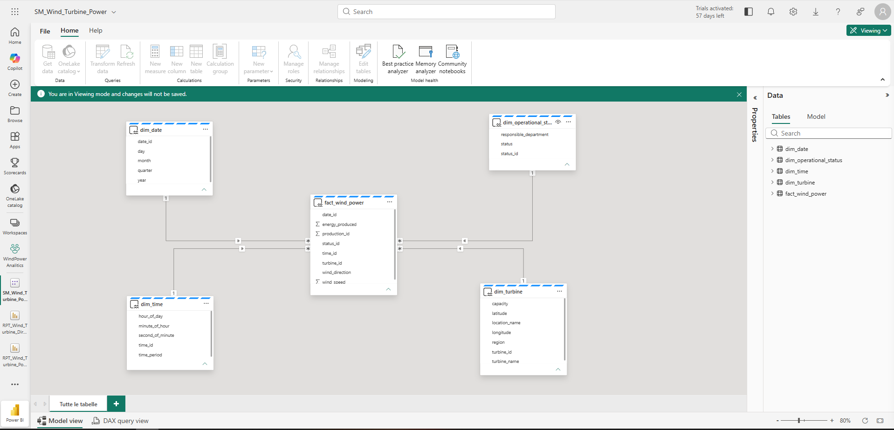
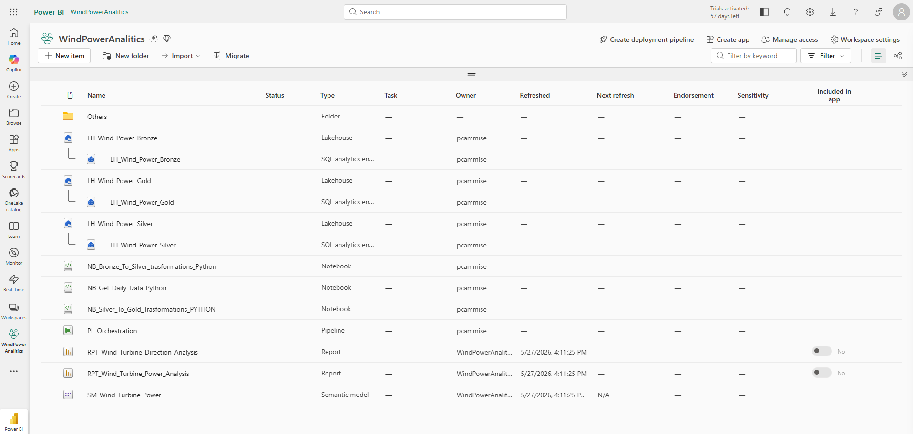
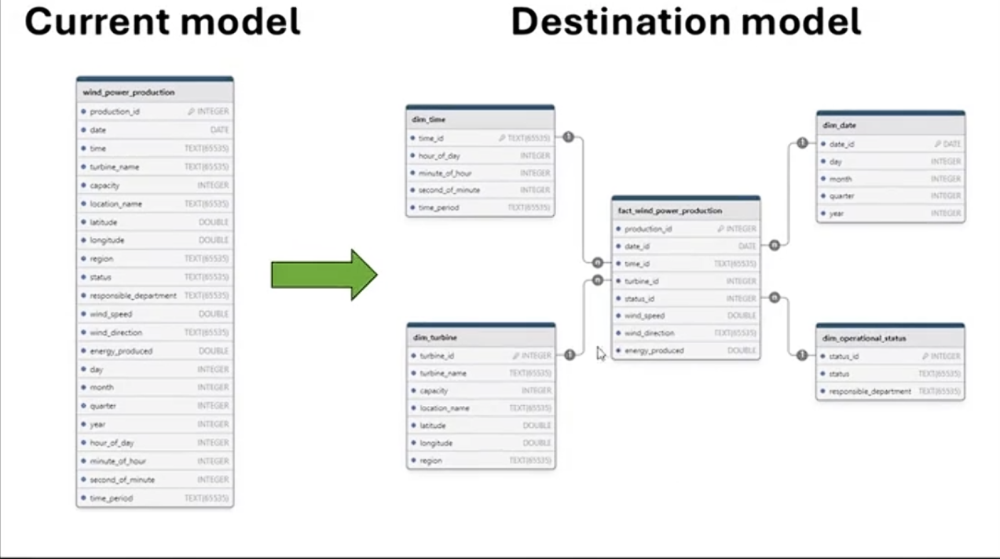

# Wind Power Analytics — Microsoft Fabric

Pipeline dati end-to-end su **Microsoft Fabric** per l'analisi della produzione di energia eolica.
Architettura Medallion (Bronze → Silver → Gold), star schema in Delta Lake, report Power BI pubblicati su Fabric workspace.

---

## Indice

- [Contesto di business](#contesto-di-business)
- [Domande analitiche](#domande-analitiche)
- [Architettura](#architettura)
- [Pipeline dati](#pipeline-dati)
- [Modello dati (Gold)](#modello-dati-gold)
- [Report Power BI](#report-power-bi)
- [Stack tecnologico](#stack-tecnologico)
- [Struttura del repository](#struttura-del-repository)

---

## Contesto di business

Il dataset simula la produzione oraria di un parco eolico composto da 3 turbine distribuite su 3 regioni geografiche degli Stati Uniti.
L'obiettivo è monitorare la produzione energetica, valutare l'impatto delle condizioni atmosferiche e supportare decisioni operative su manutenzione e ottimizzazione.

I destinatari sono: responsabili operations, analisti energetici, team di manutenzione.

---

## Domande analitiche

- Qual è la produzione media per turbina, per regione e per fascia oraria?
- Esiste una correlazione significativa tra velocità del vento e energia prodotta?
- Come varia la distribuzione della direzione del vento per turbina?
- Quali turbine mostrano i pattern di produzione più efficienti rispetto alla capacità installata?
- La produzione segue stagionalità mensile o trimestrale rilevante?

---

## Architettura

```
Fonte dati (GitHub CSV)
        │
        ▼
┌─────────────────────────────────────────────────────────────┐
│                   Microsoft Fabric Workspace                │
│                    "WindPowerAnalitics"                     │
│                                                             │
│  ┌─────────────┐    ┌─────────────┐    ┌─────────────┐     │
│  │   Bronze    │───▶│   Silver    │───▶│    Gold     │     │
│  │  Lakehouse  │    │  Lakehouse  │    │  Lakehouse  │     │
│  │  (raw data) │    │ (enriched)  │    │(star schema)│     │
│  └─────────────┘    └─────────────┘    └─────────────┘     │
│         ▲                                     │            │
│         │                                     ▼            │
│  NB_Get_Daily_Data              NB_Silver_To_Gold          │
│  NB_Bronze_To_Silver                          │            │
│                                               ▼            │
│                                    Power BI Semantic Model  │
│                                    + Report pubblicati      │
└─────────────────────────────────────────────────────────────┘
```

Schema visivo: `docs/architecture_diagram.png` *(da aggiungere — vedi TODO_manuale.md)*

---

## Pipeline dati

| Step | Notebook | Linguaggio | Descrizione |
|------|----------|------------|-------------|
| Ingestione | `NB_Get_Daily_Data_Python` | Python / PySpark | Scarica CSV giornalieri da GitHub e appende al Bronze Lakehouse |
| Bronze → Silver | `NB_Bronze_To_Silver_Transformations_Python` | PySpark | Pulizia, arrotondamenti, estrazione componenti data/ora, time_period |
| Bronze → Silver | `NB_Bronze_To_Silver_Transformations_SQL` | Spark SQL | Versione SQL equivalente delle stesse trasformazioni |
| Silver → Gold | `NB_Silver_To_Gold_Transformations_Python` | PySpark | Creazione star schema: 4 dim + 1 fact in Delta format |

Documentazione dettagliata delle trasformazioni: [`docs/transformations.md`](docs/transformations.md)

---

## Modello dati (Gold)

Star schema con 5 tabelle Delta in `LH_Wind_Power_Gold`:

```
                    ┌──────────────┐
                    │  dim_date    │
                    │  date_id (PK)│
                    │  day         │
                    │  month       │
                    │  quarter     │
                    │  year        │
                    └──────┬───────┘
                           │
┌──────────────┐    ┌──────▼────────────┐    ┌────────────────────┐
│  dim_turbine │    │  fact_wind_power  │    │  dim_time          │
│  turbine_id  │◀───│  production_id    │───▶│  time_id (PK)      │
│  turbine_name│    │  date_id (FK)     │    │  hour_of_day       │
│  capacity    │    │  time_id (FK)     │    │  minute_of_hour    │
│  location    │    │  turbine_id (FK)  │    │  second_of_minute  │
│  latitude    │    │  status_id (FK)   │    │  time_period       │
│  longitude   │    │  wind_speed       │    └────────────────────┘
│  region      │    │  wind_direction   │
└──────────────┘    │  energy_produced  │    ┌────────────────────┐
                    └───────────────────┘    │ dim_operational    │
                              │              │ _status            │
                              └────────────▶│  status_id (PK)    │
                                            │  status            │
                                            │  responsible_dept  │
                                            └────────────────────┘
```

Documentazione completa: [`docs/data_model.md`](docs/data_model.md)

---

## Report Power BI

| Report | Contenuto | File |
|--------|-----------|------|
| Wind Turbine Power Analysis | KPI produzione, trend energetico per turbina e regione, correlazione velocità/energia | [`reports/RPT_Wind_Turbine_Power_Analysis.pbix`](reports/RPT_Wind_Turbine_Power_Analysis.pbix) |
| Wind Turbine Direction Analysis | Distribuzione direzione vento per turbina, rosa dei venti, analisi per time_period | [`reports/RPT_Wind_Turbine_Direction_Analysis.pbix`](reports/RPT_Wind_Turbine_Direction_Analysis.pbix) |
| Capacity Factor Analysis | Capacity factor % per turbina e mese, scatter correlazione vento/efficienza, benchmark perdita stimata | [`reports/RPT_Capacity_Factor_Analysis.pbix`](reports/RPT_Capacity_Factor_Analysis.pbix) |
| Operational Status Analysis | Distribuzione downtime, energia persa stimata per turbina, analisi per dipartimento e periodo | [`reports/RPT_Operational_Status_Analysis.pbix`](reports/RPT_Operational_Status_Analysis.pbix) |

Export PDF disponibili in [`reports/`](reports/).

### Screenshot

*Power Analysis — Overview*


*Direction Analysis — Overview*


*Bronze Lakehouse*


*Semantic Model*



*Fabric Workspace*


*Star Schema*


---

## Stack tecnologico

| Componente | Tecnologia |
|------------|------------|
| Piattaforma | Microsoft Fabric |
| Storage | OneLake (Delta Lake format) |
| Compute | Spark (PySpark + Spark SQL) |
| Orchestrazione | Fabric Notebooks + Data Pipeline |
| Visualizzazione | Power BI (Fabric-integrated) |
| Fonte dati | CSV giornalieri via GitHub raw URL |
| Formato tabelle | Delta (Bronze, Silver, Gold) |

---

## Struttura del repository

```
wind-power-analytics-fabric/
├── README.md
├── .gitignore
├── data/
│   ├── wind_power_data.csv          ← dataset originale (6.048 righe)
│   └── data_dictionary.md           ← dizionario colonne raw e Gold
├── notebooks/
│   ├── NB_Get_Daily_Data_Python.ipynb
│   ├── NB_Bronze_To_Silver_Transformations_Python.ipynb
│   ├── NB_Bronze_To_Silver_Transformations_SQL.ipynb
│   └── NB_Silver_To_Gold_Transformations_Python.ipynb
├── reports/
│   ├── RPT_Wind_Turbine_Power_Analysis.pbix
│   ├── RPT_Wind_Turbine_Power_Analysis.pdf
│   ├── RPT_Wind_Turbine_Direction_Analysis.pbix
│   └── RPT_Wind_Turbine_Direction_Analysis.pdf
├── docs/
│   ├── data_model.md
│   ├── transformations.md
│   └── schema_diagram.png           ← da aggiungere
└── screenshots/
    ├── workspace.png
    ├── star_schema.png
    ├── LH_Wind_Power_bronze.png
    ├── SM_Wind_Turbine_Power1.png
    ├── SM_Wind_Turbine_Power2.png
    ├── BRT_Wind_Turbine_Power_Analysis.png
    └── BRT_Wind_Turbine_Direction_Analysis.png
```

---

*Pietro Cammise · Wind Power Analytics · Microsoft Fabric · 2024–2025*

---

This project is licensed under the [MIT License](LICENSE)
